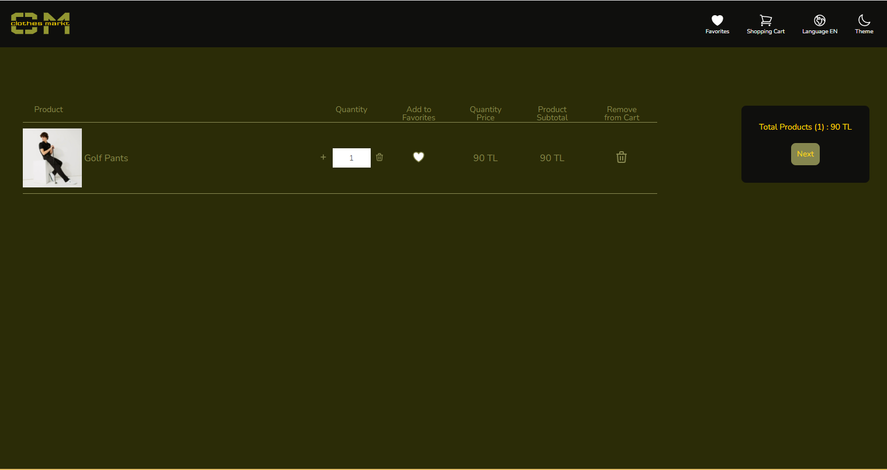
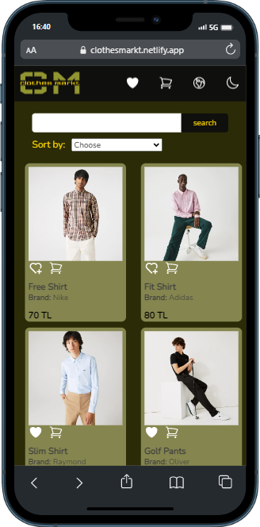
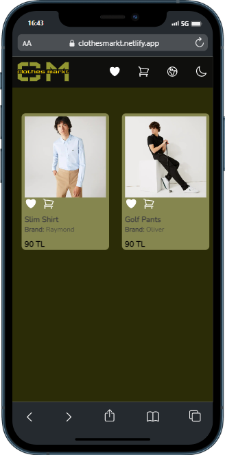
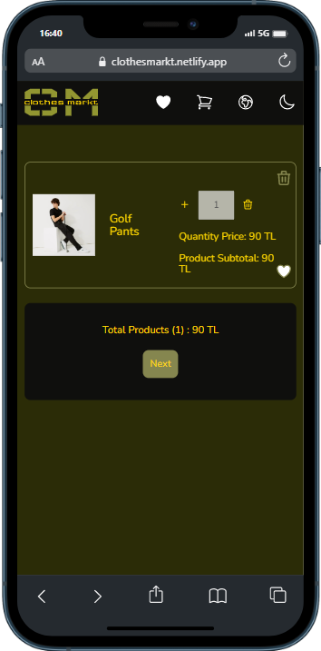
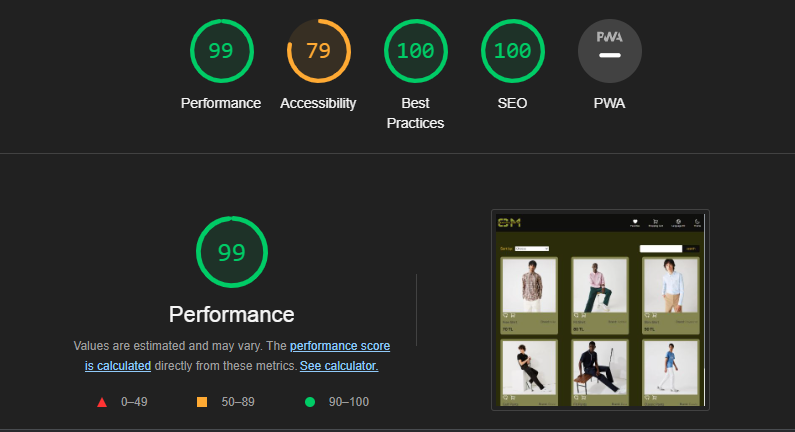
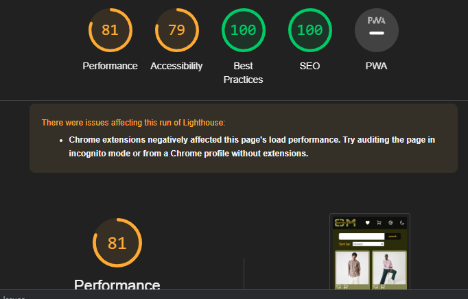

<div align='center'>
    <div>
        
    </div>
    <br/>
    <br/>
</div>

Recruitment project given by Coino Company


You can access the live demo from the link here: [ <b> Live Demo</b> ](https://clothesmarkt.netlify.app/) 


## Content

- [About](#about)
- [Used Packages And Modules](#used-packages-and-modules)
- [Installation](#installation)
- [Previews](#previews)
- [App Performance](#app-performance)

<br>

# About
- Clothes-Markt Project is an e-commerce platform that offers its users features such as adding products to the cart, removing them from the cart and adding to their favourites, and removing them from their favourites.


<br>


## Used Packages And Modules

- React JS
- React-redux
- Redux-Toolkit
- Js-cookie
- Eslint
- SASS
- Prettier
- @headlessui/react
- i18next
- Netlify

<br>

## Installation

- First, clone the project:

```
git clone https://github.com/burak-caniklioglu/clothes-markt.git
```

- Then, start the project on localhost:

```
# install dependencies with npm
npm install
# or install dependencies with yarn
yarn install

# serve at localhost:3000
npm start or yarn start
```

# Previews

<center>

## Web - Main Page


<br>
<br>

## Web - Favorite Page


<br>
<br>

## Web - Cart Page



<br>
<br>

## Mobile

<p align="center">
    
    
    
</p>
</center>

# App Performance

## Web

<p align="center">

  
</p>

## Mobile

<p align="center">

  
</p>
